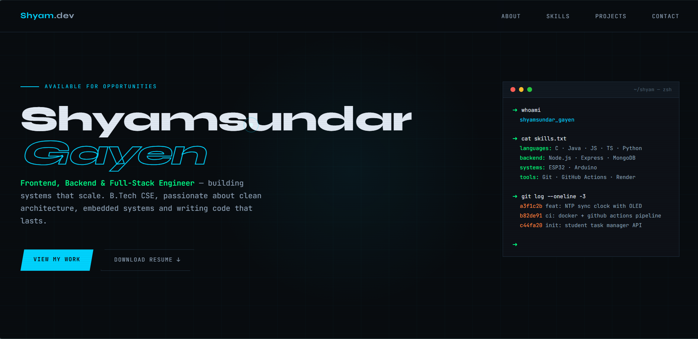
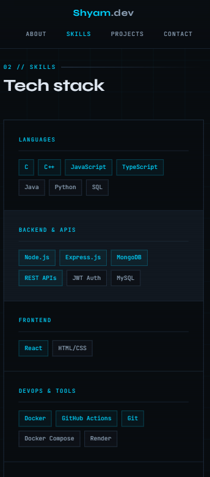

# Portfolio Website

## Overview
A personal portfolio website showcasing my projects, skills, and journey as a Full-Stack Developer.

## Features
- Responsive Design
- Project Showcase
- Modern UI

## Tech Stack
- HTML5
- CSS3
- JavaScript

## Live Demo
https://deshyam01.github.io/portfolio

## Screenshots



## Project Structure

```text
portfolio/
│
├── images/
│
├── style.css
│
├── script.js
│
├── index.html
|
└── README.md
```

| Folder/File | Purpose                                          |
| ----------- | ------------------------------------------------ |
| assets/     | Stores images of Projects                        |
| style.css   | Contains styling files                           |
| script.js   | Contains JavaScript functionality                |
| index.html  | Main entry point of the website                  |
| README.md   | Project documentation                            |

## Challenges Faced
- Had difficulties setting header in top. Usually I do it using position Fixed but this time tried with position sticky.

## Key Learnings
- This project taught me issue with position: sticky and learned to resolve it.
- Learnt how to maintain consistent typography and spacing.

## Future Improvements
- Add live screenshots of projects along with project description.
- Add a feature to dynamicaly update contents.
